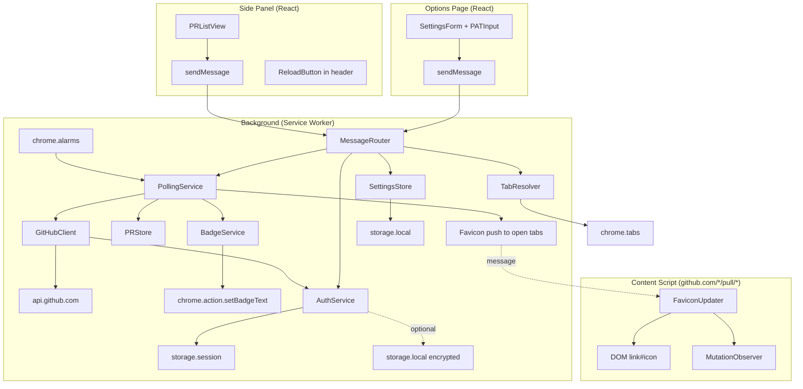

# 設計書

## 概要

「Pull Request Inbox」は WXT (Chrome MV3) + React 19 + MUI 9 で構築する Chrome 拡張機能。Background Service Worker が `chrome.alarms` で GitHub REST API を定期ポーリングし、自分がレビュワー／作成者の PR を取得する。取得結果はサイドパネル UI（React）で役割×リポジトリ階層にリッチ表示され、カードクリックで既存タブにフォーカスするか新規タブで開く。**タブの自動生成・自動クローズ・タブグループ管理は一切行わない**。未対応 PR の件数はツールバーアイコンのバッジに表示される。ユーザーが実際に開いている PR タブには Content Script が favicon をステータスに応じて書き換え、MutationObserver で維持する。PAT は `chrome.storage.session` を第一選択とし、opt-in で Web Crypto API による AES-GCM 暗号化のうえ `chrome.storage.local` に永続化できる。Content Script は PAT を一切扱わない。

## コード再利用の分析

### 既存コードの活用
- **`extensions/tab-switcher/src/entrypoints/background.ts`**: Service Worker の初期化パターン（`defineBackground` + Manager クラス + `registerBackground` でリスナー登録）を踏襲
- **`extensions/tab-switcher/src/types/messages.ts`**: 型付き Discriminated Union による Background ↔ UI 間のメッセージング設計を踏襲
- **`packages/shared/src/index.ts`** の `getStorageItem` / `setStorageItem`: 設定値（ポーリング間隔、トグル類、UI 状態）の保存に利用。PAT は独自の `AuthService` 経由（session + 暗号化のため）
- **`packages/ui/src/theme.ts`** の MUI ダーク/ライトテーマ: サイドパネルとオプションページで統一的に使用
- **`extensions/tab-switcher/` の Vitest / Storybook / Biome 設定**: 設定ファイルをコピーして拡張機能を初期化

### 統合ポイント
- **GitHub REST API (`https://api.github.com`)**: Search API (`/search/issues`) で PR 一覧、`/repos/{owner}/{repo}/pulls/{n}` で詳細、`/repos/{owner}/{repo}/commits/{sha}/check-runs` で CI、レビュー状態は PR 詳細に含まれる
- **Chrome Extension API**: `chrome.alarms`, `chrome.tabs`, `chrome.sidePanel`, `chrome.action`, `chrome.storage.session`/`local`, `chrome.runtime.onMessage`（`chrome.tabGroups` は使用しない）
- **WXT エントリポイント規約**: `src/entrypoints/background.ts`, `src/entrypoints/content.ts`, `src/entrypoints/sidepanel/`, `src/entrypoints/options/`

## アーキテクチャ

3 つのランタイムコンテキスト（Background / Content Script / UI）に責務を分割し、**PAT は Background のみが扱う**という制約でセキュリティ境界を守る。Content Script は favicon 書き換え専用で、PAT もキャッシュデータも触らない。UI（サイドパネル / オプションページ）は Background にメッセージを送って操作する薄いレイヤ。**タブを能動的に生成するのは「ユーザーがサイドパネルのカードをクリックしたとき」のみ**。

### モジュラー設計の方針
- **単一ファイル責任**: API クライアント、ポーリング、ストア、認証、タブ解決は別ファイル
- **レイヤ分離**:
  - データ層: `GitHubClient`, `PRStore`, `AuthService`, `SettingsStore`
  - ビジネスロジック層: `PollingService`, `StatusResolver`, `BadgeService`, `TabResolver`
  - プレゼンテーション層: React コンポーネント（サイドパネル / オプションページ / Content Script の FaviconUpdater）
- **疎結合**: 各層は型付きインターフェースを介してのみやり取りし、モック化しやすい構造にする



## コンポーネントとインターフェース

### 1. `AuthService`（Background）
- **目的:** PAT の保管・取得・検証・削除。`storage.session` を第一選択とし、opt-in で `storage.local` に AES-GCM 暗号化して永続化する
- **インターフェース:**
  ```typescript
  class AuthService {
    init(): Promise<void>; // 起動時に local から復号してメモリに復元
    getToken(): Promise<string | null>;
    setToken(token: string, persist: boolean): Promise<void>;
    clearToken(): Promise<void>;
    verify(token: string): Promise<GitHubUser>; // /user を叩いて検証
    hasToken(): Promise<boolean>;
  }
  ```
- **依存関係:** `chrome.storage.session`, `chrome.storage.local`, Web Crypto API, `GitHubClient`（検証のみ）
- **セキュリティ詳細:**
  - 起動時に `chrome.storage.session.setAccessLevel({ accessLevel: 'TRUSTED_CONTEXTS' })` を呼び、content script を遮断
  - 暗号化は PBKDF2 (SHA-256, 100k iter) + AES-GCM。salt は拡張機能固有の定数、パスフレーズは `navigator.userAgent` + ハード固定シード（※多層防御として位置づけ、完全秘匿ではない旨をオプション画面に明示）
  - `persist=false` のときは local を削除

### 2. `GitHubClient`（Background）
- **目的:** GitHub REST API へのリクエスト封じ込め。認証ヘッダ付与、レート制限監視、タイムアウト、エラー種別判定
- **インターフェース:**
  ```typescript
  class GitHubClient {
    constructor(auth: AuthService);
    getCurrentUser(): Promise<GitHubUser>;
    searchReviewRequestedPRs(): Promise<PullRequestSummary[]>;
    searchAuthoredPRs(): Promise<PullRequestSummary[]>;
    getPullRequest(owner: string, repo: string, number: number): Promise<PullRequestDetail>;
    getCheckRuns(owner: string, repo: string, sha: string): Promise<CheckRunSummary>;
    getRateLimit(): RateLimitInfo;
  }
  ```
- **依存関係:** `AuthService`, `fetch`
- **リトライ戦略:** ネットワークエラーのみ指数バックオフ（1s → 2s → 4s、最大 3 回）。4xx はリトライせず即エラー

### 3. `PollingService`（Background）
- **目的:** `chrome.alarms` によるポーリング起動と、PR 取得 → 差分計算 → ストア更新 → バッジ更新 → 開いている PR タブの favicon 通知までのオーケストレーション
- **インターフェース:**
  ```typescript
  class PollingService {
    constructor(
      client: GitHubClient,
      store: PRStore,
      badge: BadgeService,
      settings: SettingsStore,
    );
    start(): Promise<void>;
    stop(): Promise<void>;
    pollNow(): Promise<PollResult>;
    private onAlarm(alarm: chrome.alarms.Alarm): void;
    private notifyOpenTabs(diff: PRDiff): Promise<void>;
  }
  ```
- **アルゴリズム:**
  1. Settings からポーリング間隔を取得、`chrome.alarms.create` で登録
  2. 発火時、`client.searchReviewRequestedPRs()` / `searchAuthoredPRs()` を並行呼び出し
  3. 各 PR について CI 状態が必要なら `getCheckRuns` を追加フェッチ
  4. `StatusResolver` で最終ステータスを決定
  5. `PRStore` に保存、差分を返す
  6. `BadgeService.update(store.getAll())` でバッジ更新
  7. 現在開いている PR タブを `chrome.tabs.query({ url: 'https://github.com/*/*/pull/*' })` で取得
  8. 各タブに対し `FAVICON_UPDATE` メッセージを送信（ステータスまたは「解除」を含む）
  9. `RateLimit.remaining < 100` なら alarms の間隔を一時的に 2 倍に延長

### 4. `PRStore`（Background）
- **目的:** 現在の PR 状態と前回取得分の差分計算、`chrome.storage.local` への永続化（機密情報なし）
- **インターフェース:**
  ```typescript
  class PRStore {
    init(): Promise<void>;
    getAll(): PullRequest[];
    findByUrl(url: string): PullRequest | null; // FaviconUpdater 問い合わせ用
    upsertBatch(prs: PullRequest[], currentUser: string, settings: Settings): PRDiff;
    remove(prId: string): void;
    persist(): Promise<void>;
  }

  type PRDiff = {
    added: PullRequest[];
    updated: PullRequest[];
    removed: PullRequest[]; // サイドパネルから消える: マージ/クローズ/レビュー完了
  };
  ```
- **除去判定:** `upsertBatch` 内で以下を適用（タブ操作は一切しない）
  - `isMerged || isClosed` → 除去
  - `role === 'reviewer'` かつ `myReviewState in ['approved', 'changes_requested']` かつ `settings.keepAfterReviewCompleted === false` → 除去
- **依存関係:** `chrome.storage.local`

### 5. `TabResolver`（Background）
- **目的:** サイドパネルのカードクリック時に「既存タブへフォーカス」または「新規タブを開く」を決定する（タブグループ化は行わない）
- **インターフェース:**
  ```typescript
  class TabResolver {
    focusOrOpen(prUrl: string): Promise<void>;
  }
  ```
- **動作:**
  1. `chrome.tabs.query({ url: prUrl })` で既存タブを検索
  2. 見つかったら `chrome.tabs.update(tabId, { active: true })` + `chrome.windows.update(windowId, { focused: true })`
  3. 見つからなければ `chrome.tabs.create({ url: prUrl, active: true })`
- **依存関係:** `chrome.tabs`, `chrome.windows`

### 6. `BadgeService`（Background）
- **目的:** `chrome.action.setBadgeText` / `setBadgeBackgroundColor` で未対応 PR 件数を表示
- **インターフェース:**
  ```typescript
  class BadgeService {
    constructor(settings: SettingsStore);
    update(prs: PullRequest[]): Promise<void>;
    clear(): Promise<void>;
  }
  ```
- **ロジック:**
  - 要件 5 の「未対応 PR」定義で件数をカウント
  - 件数 > 0 なら `setBadgeText({ text: count > 99 ? '99+' : String(count) })`
  - 色は要件 5 の優先度に従って決定（赤 > 黄 > 青）
  - `settings.showBadge === false` なら常に clear
- **依存関係:** `chrome.action`, `SettingsStore`

### 7. `SettingsStore`（Background / 全コンテキストから読み取り）
- **目的:** ユーザー設定の保存・取得・変更通知
- **インターフェース:**
  ```typescript
  class SettingsStore {
    init(): Promise<void>;
    get(): Settings;
    update(partial: Partial<Settings>): Promise<void>;
    onChange(cb: (settings: Settings) => void): () => void;
  }

  type Settings = {
    pollingIntervalMinutes: number; // 1-10
    keepAfterReviewCompleted: boolean;
    showBadge: boolean;
    persistToken: boolean;
    collapsedRepos: Record<string, boolean>; // UI状態
  };
  ```
- **依存関係:** `packages/shared` の `getStorageItem` / `setStorageItem`

### 8. `StatusResolver`（Background, ピュア関数）
- **目的:** PR 詳細 + CheckRuns からステータスを決定する純粋関数。テストしやすく副作用なし
- **インターフェース:**
  ```typescript
  function resolveStatus(
    pr: PullRequestDetail,
    checks: CheckRunSummary,
  ): PullRequestStatus;

  type PullRequestStatus =
    | 'ci_failing'
    | 'changes_requested'
    | 'approved'
    | 'ci_pending'
    | 'review_required';
  ```
- **優先度ロジック:** 要件 4 の順序で判定
- **依存関係:** なし（純粋関数）

### 9. `MessageRouter`（Background）
- **目的:** `chrome.runtime.onMessage` で UI（サイドパネル / オプション）と Content Script からのメッセージを型付きで捌く
- **扱うメッセージ:** 「データモデル - メッセージ型」セクション参照

### 10. `FaviconUpdater`（Content Script）
- **目的:** PR ページの `<link rel="icon">` をステータス favicon に差し替え、ページが元に戻そうとしても MutationObserver で維持
- **インターフェース:**
  ```typescript
  class FaviconUpdater {
    init(): void;
    setStatus(status: PullRequestStatus | null): void; // null は解除
    private observe(): void;
    private enforce(): void;
    private restore(): void; // 元の favicon に戻す
  }
  ```
- **動作フロー:**
  1. Content Script 起動時、Background に `GET_PR_STATUS { url: location.href }` を送信
  2. 返信のステータスで `setStatus` を呼ぶ（null の場合は何もしない or 既存 favicon を維持）
  3. `MutationObserver` で `<head>` を監視し、GitHub 側が `<link rel="icon">` を書き換えたら再適用
  4. `chrome.runtime.onMessage` で Background からの `FAVICON_UPDATE` も受信
  5. ステータス変化通知で `status === null` を受けたら `restore()` で元の favicon に戻す

### 11. サイドパネル React コンポーネント
- **`SidePanelApp`**（ルート）: ThemeProvider, Error Boundary, データ取得フック
- **`SidePanelHeader`**: 拡張機能名 + **リロードボタン**（`refresh` IconButton、さりげなくヘッダ右端に配置、実行中は回転アニメーション、最終更新時刻を隣に相対表示、ホバーでツールチップ）
- **`PRListView`**: `useEffect` で Background に `GET_ALL_PRS` を送信しストアを購読、`Reviewer` / `Author` セクションを描画
- **`RoleSection`**: 役割セクション、内部にリポジトリごとの `RepoSection`
- **`RepoSection`**: 折りたたみ可能なリポジトリセクション、`collapsedRepos` 設定と連動
- **`PRCard`**: 1 件の PR カード。クリックで `sendMessage({ type: 'FOCUS_PR', prId })` → `TabResolver.focusOrOpen`
- **`StatusBadge`**: ステータスに応じたアイコン/色
- **`EmptyState` / `ErrorState` / `PATNotConfiguredState`**: 状態別プレースホルダ
- **`useSettings` / `usePRs`**: `chrome.storage.onChanged` または `runtime.onMessage` で購読するフック

### 12. オプションページ React コンポーネント
- **`OptionsApp`**: ThemeProvider, タブ分け（Authentication / Polling / Notifications / Advanced）
- **`PATSection`**: 入力（`type=password` + `autocomplete=off` + `spellcheck=false`）、検証ボタン、永続化トグル、Fine-grained PAT ガイドリンク、注意書き
- **`PollingSection`**: ポーリング間隔スライダ
- **`NotificationsSection`**: バッジ表示トグル、レビュー完了後も残すトグル
- **`DangerSection`**: PAT とキャッシュの削除ボタン

## データモデル

### コアモデル

```typescript
// 共通 (shared types)
export type PullRequestRole = 'reviewer' | 'author';

export type PullRequestStatus =
  | 'ci_failing'
  | 'changes_requested'
  | 'approved'
  | 'ci_pending'
  | 'review_required';

export type PullRequest = {
  id: string; // `${owner}/${repo}#${number}`
  owner: string;
  repo: string;
  number: number;
  title: string;
  url: string; // html_url
  author: {
    login: string;
    avatarUrl: string;
  };
  role: PullRequestRole;
  status: PullRequestStatus;
  isDraft: boolean;
  isMerged: boolean;
  isClosed: boolean;
  myReviewState: 'pending' | 'approved' | 'changes_requested' | 'commented' | null;
  checks: {
    success: number;
    failure: number;
    pending: number;
  };
  reviews: {
    approvedCount: number;
    requiredCount: number;
  };
  updatedAt: string; // ISO
  fetchedAt: string; // ISO
  isNew: boolean; // 前回取得時になかった or 差分あり
};

export type GitHubUser = {
  login: string;
  avatarUrl: string;
};
```

### メッセージ型

```typescript
// UI → Background
export type UIMessage =
  | { type: 'GET_ALL_PRS' }
  | { type: 'POLL_NOW' }
  | { type: 'FOCUS_PR'; prId: string } // TabResolver.focusOrOpen へ
  | { type: 'GET_SETTINGS' }
  | { type: 'UPDATE_SETTINGS'; partial: Partial<Settings> }
  | { type: 'SET_TOKEN'; token: string; persist: boolean }
  | { type: 'CLEAR_TOKEN' }
  | { type: 'VERIFY_TOKEN'; token: string }
  | { type: 'GET_AUTH_STATE' };

// Content Script → Background
export type ContentMessage =
  | { type: 'GET_PR_STATUS'; url: string };

// Background → Content Script
export type BackgroundToContentMessage =
  | { type: 'FAVICON_UPDATE'; status: PullRequestStatus | null };

// Background → UI
export type BackgroundResponse =
  | { type: 'PRS'; prs: PullRequest[]; lastPolledAt: string }
  | { type: 'SETTINGS'; settings: Settings }
  | { type: 'AUTH_STATE'; user: GitHubUser | null; hasToken: boolean }
  | { type: 'VERIFY_RESULT'; ok: boolean; user?: GitHubUser; error?: string }
  | { type: 'PR_STATUS'; status: PullRequestStatus | null } // GET_PR_STATUS の応答
  | { type: 'OK' }
  | { type: 'ERROR'; message: string };
```

### ストレージレイアウト

```
chrome.storage.session (TRUSTED_CONTEXTS)
├── pat_token: string                 // PAT 平文（メモリのみ）

chrome.storage.local
├── pat_encrypted: { iv: string; data: string } | null  // persist=true の時のみ
├── settings: Settings
├── pr_cache: PullRequest[]
└── last_polled_at: string             // ISO
```

## ファイル構成

```
extensions/pull-request-inbox/
├── package.json
├── wxt.config.ts
├── tsconfig.json
├── vitest.config.ts
├── src/
│   ├── entrypoints/
│   │   ├── background.ts
│   │   ├── content.ts               // github.com/*/pull/* にマッチ
│   │   ├── sidepanel/
│   │   │   ├── index.html
│   │   │   └── main.tsx
│   │   └── options/
│   │       ├── index.html
│   │       └── main.tsx
│   ├── background/
│   │   ├── AuthService.ts
│   │   ├── GitHubClient.ts
│   │   ├── PollingService.ts
│   │   ├── PRStore.ts
│   │   ├── TabResolver.ts
│   │   ├── BadgeService.ts
│   │   ├── SettingsStore.ts
│   │   ├── StatusResolver.ts
│   │   ├── MessageRouter.ts
│   │   ├── crypto.ts               // AES-GCM ラッパ
│   │   └── registerBackground.ts
│   ├── content/
│   │   └── FaviconUpdater.ts
│   ├── sidepanel/
│   │   ├── SidePanelApp.tsx
│   │   ├── SidePanelHeader.tsx     // リロードボタン + 最終更新時刻
│   │   ├── PRListView.tsx
│   │   ├── RoleSection.tsx
│   │   ├── RepoSection.tsx
│   │   ├── PRCard.tsx
│   │   ├── StatusBadge.tsx
│   │   ├── EmptyState.tsx
│   │   └── hooks/
│   │       ├── usePRs.ts
│   │       └── useSettings.ts
│   ├── options/
│   │   ├── OptionsApp.tsx
│   │   ├── PATSection.tsx
│   │   ├── PollingSection.tsx
│   │   ├── NotificationsSection.tsx
│   │   └── DangerSection.tsx
│   ├── types/
│   │   ├── models.ts
│   │   └── messages.ts
│   ├── utils/
│   │   ├── relativeTime.ts
│   │   └── githubUrl.ts
│   └── public/
│       ├── icons/                  // 拡張機能アイコン
│       └── favicons/               // ステータス favicon (5種)
│           ├── ci-failing.svg
│           ├── changes-requested.svg
│           ├── approved.svg
│           ├── ci-pending.svg
│           └── review-required.svg
```

## エラーハンドリング

### エラーシナリオ

1. **PAT 未設定**
   - **対処:** サイドパネル・Background ともに `PATNotConfigured` 状態にし、ポーリング停止、バッジクリア
   - **ユーザーへの影響:** サイドパネルに「PAT を設定してください」＋オプションページへのリンク

2. **PAT 無効 / 期限切れ**
   - **対処:** `GitHubClient` が 401 を受けたら `AuthService` を `invalid` 状態にし、ポーリング停止
   - **ユーザーへの影響:** サイドパネルにエラー＋再設定導線。バッジは警告色（赤 `!`）

3. **レート制限到達**
   - **対処:** `X-RateLimit-Remaining=0` を検出したら、`X-RateLimit-Reset` までポーリングをスキップ
   - **ユーザーへの影響:** サイドパネルに「API制限中 HH:MM まで待機」表示

4. **ネットワーク断 / タイムアウト**
   - **対処:** 指数バックオフ（1s→2s→4s）、3 回連続失敗でエラー状態へ
   - **ユーザーへの影響:** 「ネットワークエラー」表示＋リロードボタンで手動リトライ可能

5. **暗号化 PAT の復号失敗**
   - **対処:** 復号に失敗したら local から削除し、`PATNotConfigured` 状態に遷移
   - **ユーザーへの影響:** サイドパネルに「PAT を再入力してください」

6. **Content Script が PR 以外のページで起動**
   - **対処:** `matches` で `https://github.com/*/*/pull/*` に絞る。WXT 側で保証される
   - **ユーザーへの影響:** なし

7. **PR 詳細取得時に 404（リポジトリ削除等）**
   - **対処:** `PRStore` から該当 PR を削除
   - **ユーザーへの影響:** サイレント

8. **PR カードのクリックでタブ作成失敗**
   - **対処:** エラートーストを表示し、ユーザーに再試行を促す
   - **ユーザーへの影響:** エラー通知

## テスト戦略

### ユニットテスト（Vitest + jsdom）
- **`StatusResolver`**: 各ステータス優先順位の境界値テスト（全パターン網羅）
- **`PRStore`**: `upsertBatch` の差分計算（added / updated / removed）、除去判定（マージ/クローズ/レビュー完了、`keepAfterReviewCompleted` 設定の影響）
- **`GitHubClient`**: `fetch` をモックし、認証ヘッダ付与、レート制限読み取り、リトライ回数、タイムアウトをテスト
- **`AuthService`**: `chrome.storage.*` と `crypto.subtle` をモック、session 保存／暗号化 local 保存／復号／削除のテスト
- **`TabResolver`**: `chrome.tabs.query` をモック、既存タブ発見時の focus 挙動、未発見時の create 挙動
- **`BadgeService`**: PR リストからの件数計算、色決定、99+ の閾値、`showBadge` 設定の影響
- **`PollingService`**: 各依存をモックし、ポーリングサイクルで `client.search*` → `store.upsertBatch` → `badge.update` → open tabs への `FAVICON_UPDATE` 送信の順序
- **React コンポーネント**: `PRCard`, `StatusBadge`, `RoleSection`, `PATSection`, `SidePanelHeader`（リロードボタンクリック → `POLL_NOW`）
- **`FaviconUpdater`**: `jsdom` で `<link rel="icon">` 書き換え、MutationObserver 再適用、`status=null` 時の restore 挙動

### 統合テスト（Vitest、薄め）
- **Background エントリポイント**: `background.ts` の初期化順、`registerBackground` での listener 登録
- **メッセージルーティング**: `MessageRouter` が UI メッセージを正しく各サービスに委譲すること

### Storybook テスト
- `PRCard`, `StatusBadge`, `PRListView`（ダミーデータで多様な状態）, `SidePanelHeader`, `PATSection`
- ダーク/ライトテーマの視覚確認

### 手動テスト
- PAT 設定 → ポーリング → サイドパネル表示 → カードクリックで既存タブフォーカス / 新規タブオープン
- PR タブを手動で開いた状態でポーリング → favicon が書き換わる
- マージ後にサイドパネルから消える（タブは触られない）
- レビュー完了後の除去（設定 OFF/ON の双方）
- バッジ表示の色・件数・99+ 閾値
- リロードボタンの回転アニメーション + 最終更新時刻表示
- `chrome.storage.session` がブラウザ再起動で消える挙動の確認
- オプションの永続化トグル ON/OFF の挙動確認

### カバレッジ目標
- ビジネスロジック層（`StatusResolver`, `PRStore`, `PollingService`, `TabResolver`, `BadgeService`, `AuthService`）: 90%+
- React コンポーネント: 主要な描画パスと操作フローをカバー
- Storybook 側では視覚回帰の確認を主とし、単体の描画テストはユニットに寄せる
