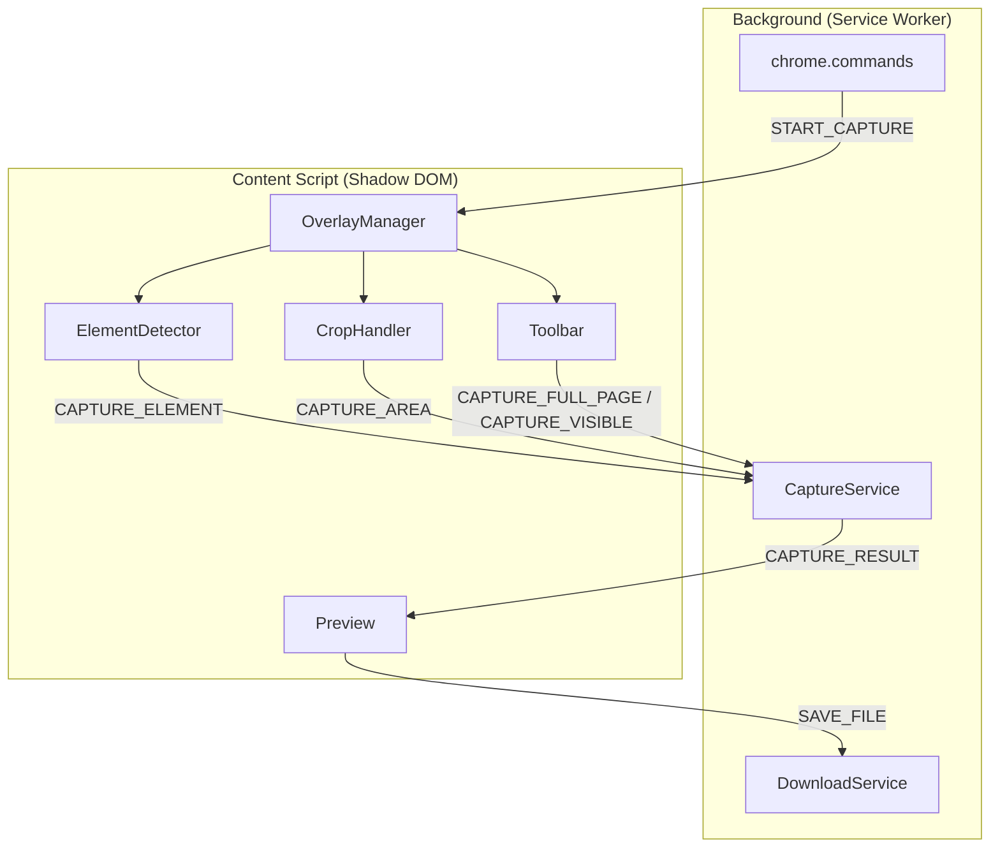

# 設計書

## 概要

Screenshot 拡張機能は、Content Script が Shadow DOM 内にキャプチャオーバーレイ UI を描画し、Background（Service Worker）が `chrome.tabs.captureVisibleTab` API で実際の画像キャプチャを実行するアーキテクチャ。tab-switcher のメッセージング・Shadow DOM パターンを踏襲しつつ、キャプチャ固有のモード管理（要素検知 / トリミング / ページ全体 / 表示領域）を追加する。

## コード再利用の分析

### 既存コードの活用
- **`packages/ui/`**: ダーク/ライトテーマ、Emotion キャッシュ設定、CssBaseline をツールバー UI に利用
- **`packages/shared/`**: `getStorageItem` / `setStorageItem` で設定（最後に使ったモード等）の永続化
- **tab-switcher の OverlayManager パターン**: Shadow DOM ホスト生成、Emotion キャッシュ注入、イベント遮断ロジックを参考に実装

### 統合ポイント
- **Chrome Tabs API**: `chrome.tabs.captureVisibleTab()` でタブの表示領域をキャプチャ
- **Chrome Downloads API**: `chrome.downloads.download()` でファイル保存
- **Clipboard API**: `navigator.clipboard.write()` でクリップボードへの自動コピー

## アーキテクチャ

キャプチャ処理は Background で実行し、UI（オーバーレイ、ツールバー、プレビュー）は Content Script の Shadow DOM 内で描画する。

### モジュラー設計の方針
- **単一ファイル責任**: キャプチャモードごとにハンドラを分離、UI コンポーネントはツールバー / プレビュー / オーバーレイを独立
- **コンポーネント分離**: キャプチャロジック（座標計算、要素検知）と UI（React コンポーネント）を分離
- **レイヤー分離**: Background（キャプチャ実行・保存）/ Content（UI・ユーザーインタラクション）/ 型定義（メッセージ契約）



## コンポーネントとインターフェース

### CaptureService（Background）
- **目的:** 画像キャプチャの実行を一元管理する
- **インターフェース:**
  - `captureVisibleArea(): Promise<string>` — 表示領域をキャプチャし data URL を返す
  - `captureFullPage(tabId: number): Promise<string>` — スクロールキャプチャで全ページを結合
  - `cropImage(dataUrl: string, rect: CropRect): Promise<string>` — data URL からキャンバスでトリミング
- **依存関係:** `chrome.tabs.captureVisibleTab`, OffscreenDocument（Canvas 操作用）

### DownloadService（Background）
- **目的:** ファイル保存とクリップボードコピーの実行
- **インターフェース:**
  - `saveAsFile(dataUrl: string): Promise<void>` — PNG ファイルとしてダウンロード
  - `copyToClipboard(dataUrl: string): Promise<void>` — クリップボードにコピー
- **依存関係:** `chrome.downloads.download`, `chrome.offscreen` (Clipboard API 用)

### OverlayManager（Content Script）
- **目的:** Shadow DOM ホストを生成し、キャプチャ UI 全体を管理する
- **インターフェース:**
  - `show(): void` — オーバーレイを表示（暗転 + ツールバー）
  - `hide(): void` — オーバーレイを非表示
  - `setMode(mode: CaptureMode): void` — キャプチャモードを切り替え
- **依存関係:** React, Emotion, `packages/ui/`
- **実装パターン:** tab-switcher の OverlayManager を参考に Shadow DOM + Emotion キャッシュを構築。z-index: 2147483647、font-size リセット、イベント遮断を踏襲

### ElementDetector（Content Script）
- **目的:** マウスホバーで DOM 要素を検知し、ハイライト表示する
- **インターフェース:**
  - `start(): void` — mousemove リスナーを登録
  - `stop(): void` — リスナーを解除
  - `onElementSelected: (rect: DOMRect) => void` — クリック時のコールバック
  - `onDragStart: (startPoint: Point) => void` — ドラッグ開始時のコールバック
- **依存関係:** なし（DOM API のみ）
- **要素検知アルゴリズム:** `document.elementFromPoint()` でホバー位置の要素を取得。Shadow DOM ホスト自体は除外する

### CropHandler（Content Script）
- **目的:** ドラッグによる矩形選択を処理する
- **インターフェース:**
  - `start(startPoint: Point): void` — ドラッグ開始
  - `stop(): void` — ドラッグ終了
  - `onCropComplete: (rect: CropRect) => void` — 選択確定時のコールバック
- **依存関係:** なし（DOM API のみ）

### Toolbar（React コンポーネント）
- **目的:** 撮影モード選択の UI
- **インターフェース:** `onFullPage()`, `onVisibleArea()`, `onSettings()`
- **依存関係:** `packages/ui/` テーマ、MUI コンポーネント

### Preview（React コンポーネント）
- **目的:** キャプチャ結果のプレビューと保存操作の UI
- **インターフェース:** `imageUrl: string`, `onSave()`, `onClose()`
- **依存関係:** `packages/ui/` テーマ、MUI コンポーネント

## データモデル

### メッセージ型

```typescript
// キャプチャ対象の矩形情報
interface CropRect {
  x: number;
  y: number;
  width: number;
  height: number;
  devicePixelRatio: number;
}

// 座標
interface Point {
  x: number;
  y: number;
}

// キャプチャモード
type CaptureMode = 'element' | 'crop' | 'fullPage' | 'visibleArea';

// Background → Content Script
type BackgroundMessage =
  | { type: 'START_CAPTURE' }
  | { type: 'CAPTURE_RESULT'; dataUrl: string }
  | { type: 'CAPTURE_PROGRESS'; progress: number }
  | { type: 'CAPTURE_ERROR'; error: string };

// Content Script → Background
type ContentMessage =
  | { type: 'CAPTURE_VISIBLE_AREA' }
  | { type: 'CAPTURE_FULL_PAGE' }
  | { type: 'CAPTURE_ELEMENT'; rect: CropRect }
  | { type: 'CAPTURE_AREA'; rect: CropRect }
  | { type: 'SAVE_FILE'; dataUrl: string }
  | { type: 'OVERLAY_CLOSED' };
```

### 設定データ（Chrome Storage）

```typescript
interface ScreenshotSettings {
  elementPadding: number;    // 要素キャプチャのパディング（デフォルト: 8px）
  maxFullPageHeight: number; // ページ全体キャプチャの上限（デフォルト: 10000px）
  toolbarPosition: 'top' | 'bottom'; // ツールバー位置
}
```

## エラーハンドリング

### エラーシナリオ
1. **キャプチャ権限エラー:** `chrome://` や拡張機能ページなどキャプチャ不可のページ
   - **対処:** トーストで「このページではキャプチャできません」と通知し、オーバーレイを閉じる
   - **ユーザーへの影響:** 撮影モードが起動しない

2. **クリップボードコピー失敗:** ブラウザのセキュリティポリシーでコピーが拒否された場合
   - **対処:** エラートーストを表示しつつ、プレビュー画面でファイル保存ボタンを案内
   - **ユーザーへの影響:** 自動コピーは失敗するが、手動でファイル保存は可能

3. **ページ全体キャプチャの上限超過:** 非常に長いページ
   - **対処:** 上限到達時に警告を表示し、上限までの範囲でキャプチャ完了
   - **ユーザーへの影響:** 10,000px を超える部分は含まれない旨の通知

## テスト戦略

### ユニットテスト
- **CropRect 計算ロジック**: デバイスピクセル比を考慮した座標変換の正確性
- **ElementDetector**: 要素検知ロジック（elementFromPoint のモック）
- **CaptureService**: captureVisibleTab の呼び出しとトリミング処理
- **メッセージ型**: 型安全性の検証

### Storybook テスト
- **Toolbar**: 各ボタンのクリックイベント、レイアウト（上部/下部配置）
- **Preview**: 画像プレビュー表示、保存/閉じるボタンの動作
- **暗転オーバーレイ**: ハイライト表示のビジュアル確認

## ファイル構成

```
extensions/screenshot/
├── wxt.config.ts
├── package.json
├── tsconfig.json
├── vitest.config.ts
├── src/
│   ├── entrypoints/
│   │   ├── background.ts          # Service Worker
│   │   └── content.ts             # Content Script エントリ
│   ├── background/
│   │   ├── CaptureService.ts      # キャプチャ実行
│   │   └── DownloadService.ts     # ファイル保存・クリップボード
│   ├── content/
│   │   ├── OverlayManager.tsx     # Shadow DOM + React マウント
│   │   ├── ElementDetector.ts     # 要素検知ロジック
│   │   └── CropHandler.ts        # ドラッグ選択ロジック
│   ├── components/
│   │   ├── CaptureOverlay.tsx     # 暗転オーバーレイ + ハイライト
│   │   ├── Toolbar.tsx            # 撮影モード選択 UI
│   │   ├── Preview.tsx            # キャプチャ結果プレビュー
│   │   └── *.stories.tsx          # Storybook stories
│   ├── types/
│   │   └── messages.ts            # メッセージ型定義
│   └── public/
│       └── _locales/              # i18n
│           ├── en/messages.json
│           └── ja/messages.json
└── .storybook/
```
