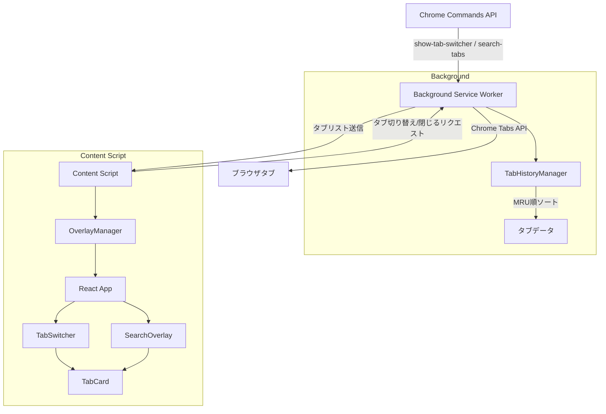

# 設計書: Tab Switcher

## 概要

Chrome拡張機能として、Background Service Worker（MRUタブ管理）と Content Script（UIオーバーレイ）の2層で構成する。WXT + React + MUI（Material UI）を使用し、Chrome Manifest V3 に準拠する。

UIはMaterial Design 3（Material You）に統一し、Chromeのネイティブなルック＆フィールに馴染ませる。MUIコンポーネントはモノレポ内の共有UIパッケージ（`@browser-extensions/ui`）として管理し、今後の拡張機能でも再利用する。

2つのモードを持つ：
- **タブ切り替えモード**（`Cmd+Shift+Space`）— MRU順リスト、キー押し続けで操作
- **ファジー検索モード**（`Cmd+Shift+P`）— テキスト入力でタブを絞り込み

## キーボードショートカット設計

### デフォルトショートカット（Commands API）
- `Cmd+Shift+Space`（Mac）/ `Ctrl+Shift+Space`（Win/Linux）→ タブ切り替えモード
- `Cmd+Shift+P`（Mac）/ `Ctrl+Shift+P`（Win/Linux）→ ファジー検索モード

これらは Chrome Commands API で登録し、`chrome://` ページ含むすべてのページで動作する。

### ショートカットのカスタマイズ
ユーザーが好みのキーに変更できる2つの方法をオプションページで案内する：

1. **`chrome://extensions/shortcuts`** — Chrome標準のショートカット設定画面。`Ctrl+Shift+数字` や `Alt+文字` 等の非予約キーに変更可能
2. **DevToolsコンソールによる予約キーの設定** — `Ctrl+Tab` や `Cmd+P` 等のブラウザ予約キーに変更したい場合、`chrome.developerPrivate.updateExtensionCommand` を使うワンタイムコマンドを提供。初回に1回実行すれば永続化される（拡張機能の再インストール時のみリセット）

## コード再利用の分析

### 既存コードの活用
- **@browser-extensions/shared**: ストレージユーティリティ（将来的にMRU永続化に使用可能）
- **@browser-extensions/ui**（新規作成）: MUIベースの共有UIコンポーネント。テーマ設定、共通コンポーネントをモノレポ全体で再利用

### 統合ポイント
- **Chrome Tabs API**: タブ一覧取得、アクティブタブ切り替え、タブ削除
- **Chrome Commands API**: キーボードショートカットの登録
- **Chrome Runtime API**: Background ↔ Content Script 間のメッセージング

## アーキテクチャ

Background Service Worker がタブの状態管理を一元化し、Content Script はUIの描画とユーザー操作のみを担う。両者は型付きメッセージでやり取りする。

### ページ種別ごとの動作

- **通常のWebページ**: Content Script で半透明オーバーレイを画面中央に表示（メインの体験）
- **制限ページ（`chrome://`、Chrome Web Store等）**: Content Script が動作しないため、UIなしでバックグラウンドから直前のタブに切り替え（フォールバック）

### モジュラー設計の方針
- **単一ファイル責任**: 各ファイルは1つの関心事を扱う
- **コンポーネント分離**: React コンポーネントは小さく焦点を絞る
- **レイヤー分離**: タブ管理（Background）、UI（Content Script）、メッセージング（共有型）を分ける



## UIデザイン方針

### Material Design 3 の採用
- **MUI（@mui/material）** をReactコンポーネントライブラリとして使用
- Chrome のネイティブUIに馴染むMaterial Design 3 テーマを適用
- ダークモード対応（オーバーレイはダークテーマをデフォルト）

### 共有UIパッケージ（@browser-extensions/ui）
- MUIのテーマ設定（カラーパレット、タイポグラフィ）を一元管理
- 拡張機能間で共通のコンポーネント（ThemeProvider ラッパー等）を提供
- 配置: `packages/ui/`

### Content Script での MUI 利用
- Shadow DOM 内に MUI をマウントするため、Emotion の `CacheProvider` で `container` を Shadow DOM のルートに指定
- ページのスタイルとの干渉を防ぐ

## ディレクトリ構成

```
packages/ui/                        # 共有UIパッケージ（新規）
├── src/
│   ├── theme.ts                    # Material Design 3 テーマ定義
│   └── index.ts                    # エクスポート
└── package.json

extensions/tab-switcher/src/
├── entrypoints/
│   ├── background.ts              # Background Service Worker エントリ
│   └── content.ts                  # Content Script エントリ
├── background/
│   └── TabHistoryManager.ts        # MRUタブ履歴管理
├── content/
│   ├── OverlayManager.ts           # Shadow DOM生成、Reactマウント
│   └── KeyboardHandler.ts          # キーボードイベント管理
├── components/
│   ├── TabSwitcher.tsx             # タブ切り替えモードのUI
│   ├── SearchOverlay.tsx           # ファジー検索モードのUI
│   ├── TabCard.tsx                 # 個別タブ表示
│   └── Overlay.tsx                 # 共通オーバーレイラッパー
├── types/
│   └── messages.ts                 # Background ↔ Content Script メッセージ型
├── utils/
│   └── fuzzyMatch.ts               # ファジーマッチロジック
└── styles/
    └── overlay.css                 # オーバーレイのスタイル
```

## コンポーネントとインターフェース

### TabHistoryManager（Background）
- **目的:** タブのアクセス履歴をインメモリで管理し、MRU順にソートして返す
- **インターフェース:**
  - `getRecentTabs(limit?: number): TabInfo[]` — MRU順のタブリストを返す
  - `getAllTabs(): TabInfo[]` — 全タブをMRU順で返す（検索用）
  - `onTabActivated(tabId: number): void` — アクセス時刻を更新
  - `onTabRemoved(tabId: number): void` — 履歴から削除
  - `onTabUpdated(tabId: number, title: string, url: string, favIconUrl: string): void` — メタデータ更新
- **依存関係:** Chrome Tabs API

### OverlayManager（Content Script）
- **目的:** Shadow DOMを生成し、Reactアプリをマウントする。ページのスタイルから隔離する
- **インターフェース:**
  - `show(mode: 'switcher' | 'search'): void` — オーバーレイを表示
  - `hide(): void` — オーバーレイを非表示
  - `isVisible(): boolean` — 表示状態の取得
- **依存関係:** React, ReactDOM, MUI, Emotion（CacheProvider で Shadow DOM 対応）

### KeyboardHandler（Content Script）
- **目的:** キーボードイベント（keydown/keyup）を監視し、修飾キーの押し続け状態を検知する
- **インターフェース:**
  - `onModifierRelease(callback: () => void): void` — 修飾キーが離されたときのコールバック登録
  - `destroy(): void` — イベントリスナーの解除
- **依存関係:** なし

### TabSwitcher（React コンポーネント）
- **目的:** MRU順のタブリストを表示し、キーボード / マウスで選択・切り替え・閉じる操作を提供
- **Props:**
  - `tabs: TabInfo[]` — 表示するタブリスト
  - `onSwitch: (tabId: number) => void` — タブ切り替え
  - `onClose: (tabId: number) => void` — タブを閉じる
  - `onDismiss: () => void` — オーバーレイを閉じる
- **依存関係:** TabCard, MUI（List, Paper）
- **MUIコンポーネント:** List, Paper（オーバーレイコンテナ）

### SearchOverlay（React コンポーネント）
- **目的:** 検索テキスト入力欄 + 絞り込み結果のタブリストを表示
- **Props:**
  - `tabs: TabInfo[]` — 全タブリスト
  - `onSwitch: (tabId: number) => void` — タブ切り替え
  - `onClose: (tabId: number) => void` — タブを閉じる
  - `onDismiss: () => void` — オーバーレイを閉じる
- **依存関係:** TabCard, fuzzyMatch, MUI（TextField, List, Paper）

### TabCard（React コンポーネント）
- **目的:** 個別のタブ情報（ファビコン、タイトル、URL）を1行で表示
- **Props:**
  - `tab: TabInfo` — タブ情報
  - `isFocused: boolean` — フォーカス状態
  - `onSelect: () => void` — 選択
  - `onClose: () => void` — 閉じる
  - `highlights?: HighlightRange[]` — ファジー検索のハイライト範囲（省略可）

## データモデル

### TabInfo
```typescript
interface TabInfo {
  id: number;
  title: string;
  url: string;
  favIconUrl: string;
  lastAccessed: number; // Date.now() のタイムスタンプ
}
```

### メッセージ型
```typescript
// Background → Content Script
type BackgroundMessage =
  | { type: 'SHOW_SWITCHER'; tabs: TabInfo[] }
  | { type: 'SHOW_SEARCH'; tabs: TabInfo[] }
  | { type: 'TAB_CLOSED'; tabId: number };

// Content Script → Background
type ContentMessage =
  | { type: 'SWITCH_TO_TAB'; tabId: number }
  | { type: 'CLOSE_TAB'; tabId: number }
  | { type: 'GET_ALL_TABS' };
```

### HighlightRange（ファジー検索用）
```typescript
interface HighlightRange {
  field: 'title' | 'url';
  start: number;
  end: number;
}
```

## エラーハンドリング

### エラーシナリオ
1. **タブが既に閉じられている**
   - **対処:** `chrome.tabs.update` / `chrome.tabs.remove` のエラーをキャッチし、タブリストから削除
   - **ユーザーへの影響:** リストから消えるだけ、エラー表示なし

2. **Content Script が読み込まれていないページ**
   - **対処:** `chrome://`, `edge://`, Chrome Web Store など拡張機能が動作しないページではオーバーレイを表示しない
   - **ユーザーへの影響:** ショートカットが反応しない（ブラウザの制約として許容）

3. **Background Service Worker の再起動**
   - **対処:** Service Worker 再起動時に `chrome.tabs.query` で現在のタブ一覧を再構築する。MRU順は失われるが、タブリスト自体は復元される
   - **ユーザーへの影響:** MRU順がリセットされる（稀なケースなので許容）

## テスト戦略

### ユニットテスト
- **TabHistoryManager**: MRU順ソート、タブの追加/削除/更新、Service Worker再起動後の復元
- **fuzzyMatch**: マッチ判定、ハイライト範囲の算出、エッジケース（空文字、特殊文字）
- **KeyboardHandler**: キーイベントの検知、修飾キーリリースの判定

### コンポーネントテスト
- **TabSwitcher**: キーボード操作（↑↓Enter Escape）、フォーカスの循環
- **SearchOverlay**: テキスト入力による絞り込み、ハイライト表示
- **TabCard**: 表示内容、バツボタンクリック、フォーカス状態のスタイル
