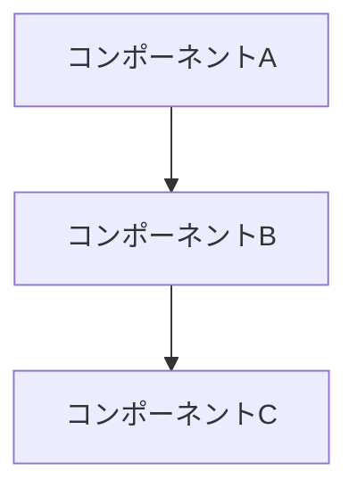

# 設計書

## 概要

[機能の高レベルな説明と、システム全体における位置づけ]

## コード再利用の分析

### 既存コードの活用
- **[コンポーネント/ユーティリティ名]**: [どう活用するか]

### 統合ポイント
- **[既存システム/API]**: [どう連携するか]

## アーキテクチャ

[全体的なアーキテクチャと採用するデザインパターン]

### モジュラー設計の方針
- **単一ファイル責任**: 各ファイルは1つの関心事を扱う
- **コンポーネント分離**: 大きなモノリシックファイルではなく、小さく焦点を絞ったコンポーネントを作る
- **レイヤー分離**: データアクセス、ビジネスロジック、プレゼンテーションを分ける



## コンポーネントとインターフェース

### コンポーネント 1
- **目的:** [このコンポーネントが何をするか]
- **インターフェース:** [公開メソッド/API]
- **依存関係:** [何に依存するか]

## データモデル

### モデル 1
```typescript
// モデルの構造を定義
```

## エラーハンドリング

### エラーシナリオ
1. **シナリオ 1:** [説明]
   - **対処:** [どう処理するか]
   - **ユーザーへの影響:** [ユーザーに何が見えるか]

## テスト戦略

### ユニットテスト
- [ユニットテストのアプローチ]

### 統合テスト
- [統合テストのアプローチ]
